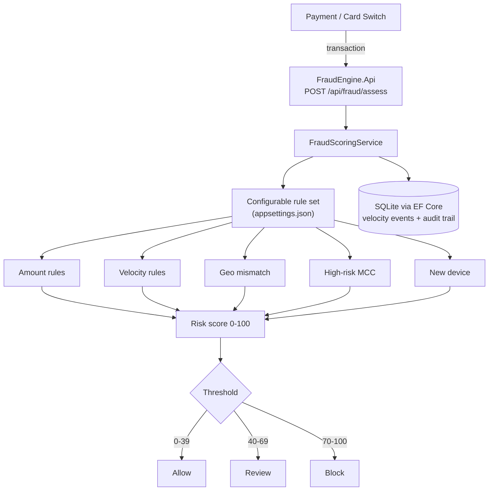

# Transaction Fraud Engine

Rule-based, real-time fraud scoring API for card and account transactions, with durable storage
for velocity counters and the assessment audit trail.

Built with **.NET 10**, **EF Core**, and **SQLite**. Deterministic rules make decisions explainable
for compliance and operations teams, and every assessment is persisted so history survives a
restart.

## Architecture



Every assessment reads and writes durable state through `FraudDbContext`: the one-hour velocity
counter is a windowed query against a `VelocityEvents` table, and the assessment (with its
rule hits) is written to `AuditRecords`/`RuleHits`. Nothing lives only in process memory, so a
restart does not lose history.

## Features

- Risk score `0–100`
- Decisions: `Allow`, `Review`, `Block`
- Rule hits returned with codes and descriptions
- Batch assessment endpoint, limited to a configurable size (default 100)
- Durable assessment history via EF Core + SQLite, with paging and lookup by transaction or customer
- Rule thresholds and scores are configuration-driven (`appsettings.json`), not hardcoded constants
- Input validation and security response headers
- OpenAPI document mapped in every environment

## Scoring rules (v1)

All thresholds and scores below are defaults from `appsettings.json` (`FraudScoring` section) and
can be changed per environment without a code change or redeploy of logic.

| Code | Signal | Default score |
|------|--------|------:|
| `AMT_ELEVATED` | Amount ≥ `AmountElevatedThreshold` (10,000) | 20 |
| `AMT_HIGH` | Amount ≥ `AmountHighThreshold` (25,000) | 40 |
| `VEL_ELEVATED` | ≥ `VelocityElevatedThreshold` (4) tx / window | 15 |
| `VEL_BURST` | ≥ `VelocityBurstThreshold` (8) tx / window | 35 |
| `NIGHT_LARGE` | Between `NightStartHourUtc`–`NightEndHourUtc` (00:00–05:00 UTC) and amount ≥ `NightLargeAmountThreshold` (3,000) | 25 |
| `GEO_MISMATCH` | Country ≠ home country | 30 |
| `MCC_RISK` | Merchant category in `HighRiskMerchantCategories` (gambling / quasi-cash / money transfer by default) | 25 |
| `NEW_DEVICE_LARGE` | New device and amount ≥ `NewDeviceAmountThreshold` (5,000) | 20 |

Velocity is tracked per customer over a rolling window (`VelocityWindowHours`, default 1 hour),
counted from persisted `VelocityEvents` rows rather than an in-process queue. The client-supplied
`transactionsLastHour` and the server-computed count are combined with `Math.Max`, so a client
cannot under-report velocity to bypass the rule.

Decision thresholds (also configurable): `ReviewThreshold` (default 40), `BlockThreshold`
(default 70), score capped at `MaxScore` (default 100).

## Diagrams

Architecture and UML diagrams are in [docs/architecture.md](docs/architecture.md) and
[docs/uml.md](docs/uml.md). A standalone index is available at [docs/index.html](docs/index.html).

## Quick start

```bash
dotnet restore
dotnet test
dotnet run --project FraudEngine.Api
```

On startup, the API applies pending EF Core migrations automatically and creates
`fraudengine.db` (SQLite) next to the running assembly if it does not already exist.

API base URL (HTTP): `http://localhost:5204`

## Run with Docker

```bash
docker compose up --build
```

The container listens on `http://localhost:8080` and stores its SQLite database in the
`fraud-engine-data` named volume (`/app/data/fraudengine.db`), so data survives container
restarts and rebuilds.

## Example request

```bash
curl -s -X POST http://localhost:5204/api/fraud/assess \
  -H "Content-Type: application/json" \
  -d "{
    \"transactionId\": \"TX-1001\",
    \"customerId\": \"CUS-42\",
    \"amount\": 27500,
    \"currency\": \"TRY\",
    \"merchantCategory\": \"4829\",
    \"countryCode\": \"DE\",
    \"customerHomeCountry\": \"TR\",
    \"occurredAt\": \"2026-07-20T01:15:00Z\",
    \"transactionsLastHour\": 5,
    \"isNewDevice\": true
  }"
```

Example response shape:

```json
{
  "transactionId": "TX-1001",
  "riskScore": 100,
  "decision": 2,
  "hits": [
    { "ruleCode": "AMT_HIGH", "description": "High transaction amount", "score": 40 }
  ]
}
```

## API

| Method | Path | Description |
|--------|------|-------------|
| `POST` | `/api/fraud/assess` | Score one transaction and persist the assessment |
| `POST` | `/api/fraud/assess/batch` | Score many transactions (bounded by `MaxBatchSize`) |
| `GET` | `/api/fraud/audit?skip=&take=` | Paged assessment history, newest first |
| `GET` | `/api/fraud/audit/transaction/{transactionId}` | Assessment history for one transaction |
| `GET` | `/api/fraud/audit/customer/{customerId}` | Assessment history for one customer |
| `GET` | `/health` | Health check |

## Configuration

Connection string and rule thresholds live in `FraudEngine.Api/appsettings.json`:

```json
{
  "ConnectionStrings": { "FraudDb": "Data Source=fraudengine.db" },
  "FraudScoring": {
    "AmountHighThreshold": 25000,
    "AmountHighScore": 40,
    "VelocityBurstThreshold": 8,
    "MaxBatchSize": 100
  }
}
```

Override any value per environment with `appsettings.{Environment}.json` or environment variables
(for example `ConnectionStrings__FraudDb`, `FraudScoring__MaxBatchSize`), no code change needed.

## Persistence

- EF Core Sqlite provider, migrations checked into `FraudEngine.Api/Migrations`
- `VelocityEvents`: one row per transaction timestamp counted toward a customer's rolling window
- `AuditRecords` / `RuleHits`: one row per assessment plus its rule hits, queried by the history endpoints
- Migrations are applied automatically at startup (`Database.Migrate()`)

## Tests

```bash
dotnet test
```

- `FraudScoringServiceTests`: unit tests against a real, file-backed SQLite database unique to
  each test (not an in-memory provider), including a test that opens a brand-new `DbContext`
  instance against the same file to prove data survives beyond the original scope
- `FraudEndpointTests`: `WebApplicationFactory` integration tests against the full HTTP pipeline,
  each with its own temp SQLite file; one test tears down the factory and boots a second one
  against the same file to prove the audit trail survives a process restart

## Limitations

- This is rule-based scoring, not a machine learning model. There is no training, no probability
  calibration, and no adaptive learning from labeled fraud outcomes.
- Velocity and audit history use SQLite for durability, which is appropriate for a single-instance
  MVP; a multi-instance production deployment would need a shared relational database (SQL Server,
  PostgreSQL) instead of a local file.
- There is no authentication/authorization on the API; it is designed to sit behind a trusted
  internal gateway or switch, not to be exposed directly to the internet.
- Rule thresholds are read once per request via `IOptionsSnapshot`, so a config file change is
  picked up on next process start/reload, not mid-request.

## License

MIT — see [LICENSE](LICENSE).
