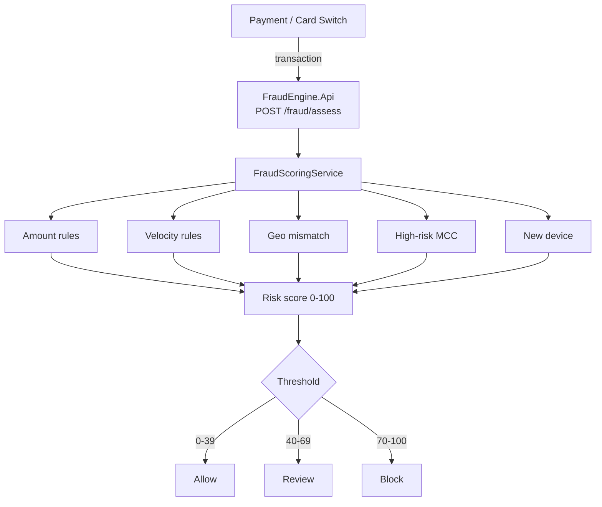

# Transaction Fraud Engine

Rule-based real-time fraud scoring API for card and account transactions.

Built with **.NET 10**. Deterministic rules make decisions explainable for compliance and operations teams.

## Architecture



Upstream systems supply velocity and device signals; this service stays stateless and returns an explainable decision with the exact rule hits.

## Features

- Risk score `0–100`
- Decisions: `Allow`, `Review`, `Block`
- Rule hits returned with codes and descriptions
- Batch assessment endpoint
- OpenAPI document included

## Scoring rules (v1)

| Code | Signal | Score |
|------|--------|------:|
| `AMT_ELEVATED` | Amount ≥ 10,000 | 20 |
| `AMT_HIGH` | Amount ≥ 25,000 | 40 |
| `VEL_ELEVATED` | ≥ 4 tx / hour | 15 |
| `VEL_BURST` | ≥ 8 tx / hour | 35 |
| `NIGHT_LARGE` | 00:00–05:00 UTC and amount ≥ 3,000 | 25 |
| `GEO_MISMATCH` | Country ≠ home country | 30 |
| `MCC_RISK` | High-risk MCC (gambling / quasi-cash / money transfer) | 25 |
| `NEW_DEVICE_LARGE` | New device and amount ≥ 5,000 | 20 |

Decision thresholds:

- `0–39` → Allow
- `40–69` → Review
- `70–100` → Block

## Quick start

```bash
dotnet restore
dotnet test
dotnet run --project FraudEngine.Api
```

API base URL (HTTP): `http://localhost:5204`

## Example request

```bash
curl -s -X POST http://localhost:5204/api/fraud/assess \
  -H "Content-Type: application/json" \
  -d "{
    \"transactionId\": \"TX-1001\",
    \"customerId\": \"CUS-42\",
    \"amount\": 27500,
    \"currency\": \"TRY\",
    \"merchantCategory\": \"4829\",
    \"countryCode\": \"DE\",
    \"customerHomeCountry\": \"TR\",
    \"occurredAt\": \"2026-07-20T01:15:00Z\",
    \"transactionsLastHour\": 5,
    \"isNewDevice\": true
  }"
```

Example response shape:

```json
{
  "transactionId": "TX-1001",
  "riskScore": 100,
  "decision": "Block",
  "hits": [
    { "ruleCode": "AMT_HIGH", "description": "High transaction amount", "score": 40 }
  ]
}
```

## API

| Method | Path | Description |
|--------|------|-------------|
| `POST` | `/api/fraud/assess` | Score one transaction |
| `POST` | `/api/fraud/assess/batch` | Score many transactions |
| `GET` | `/health` | Health check |

## Design notes

- Rules are transparent and unit-tested; useful for model-risk discussions
- Score is capped at 100
- Engine is stateless; velocity is provided by the caller (upstream aggregator / stream job)

## Tests

```bash
dotnet test
```

## License

MIT — see [LICENSE](LICENSE).
