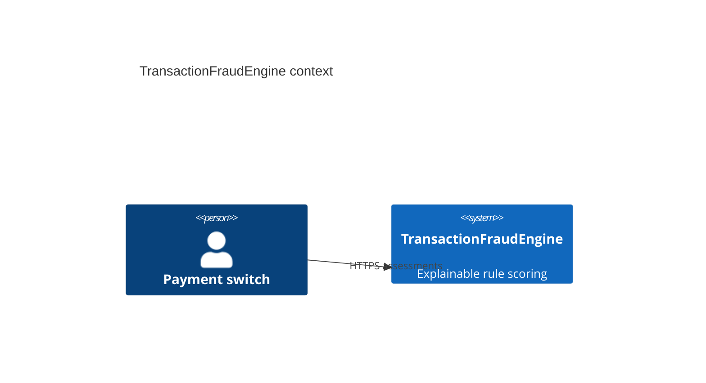
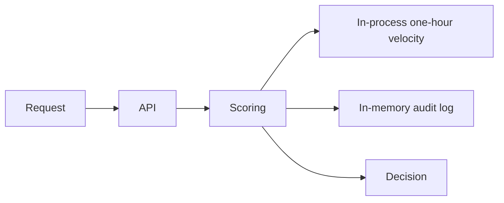

# Architecture

```mermaid
C4Context
  title TransactionFraudEngine context
  Person(switch, "Payment switch")
  System(engine, "TransactionFraudEngine", "Explainable rule scoring")
  Rel(switch, engine, "HTTPS assessments")
```

```mermaid
flowchart LR
  Request --> API --> Scoring
  Scoring --> Velocity["In-process one-hour velocity"]
  Scoring --> Audit["In-memory audit log"]
  Scoring --> Decision
```
The velocity and audit stores are in process and are reset on restart. This is a rule-based demonstrator, not an ML model or production event store.
