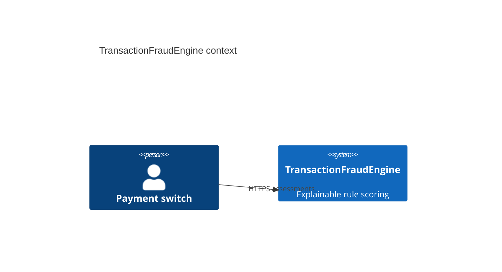
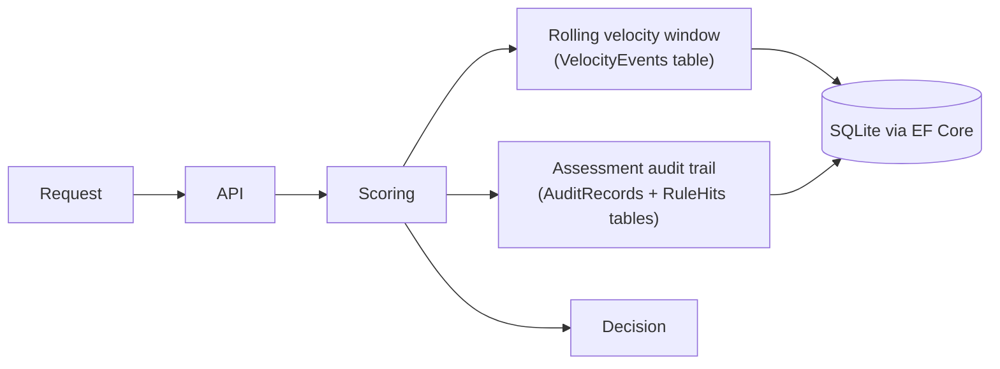

# Architecture

Velocity counters and the audit trail are persisted through EF Core to SQLite, so both survive a
process restart. Rule thresholds are configuration-driven (`appsettings.json`), not hardcoded.
This is a rule-based demonstrator, not an ML model.
