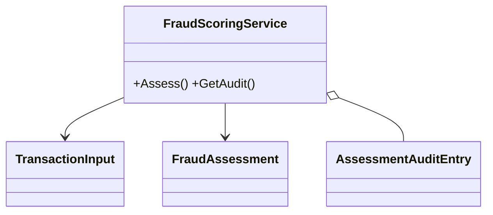
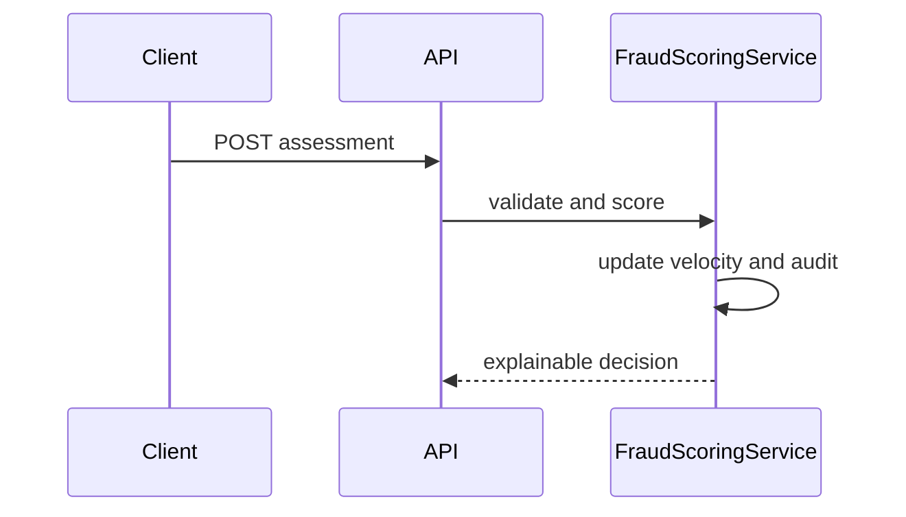

# UML

```mermaid
classDiagram
  class FraudScoringService { +Assess() +GetAudit() }
  class TransactionInput
  class FraudAssessment
  class AssessmentAuditEntry
  FraudScoringService --> TransactionInput
  FraudScoringService --> FraudAssessment
  FraudScoringService o-- AssessmentAuditEntry
```

```mermaid
sequenceDiagram
  participant C as Client
  participant A as API
  participant S as FraudScoringService
  C->>A: POST assessment
  A->>S: validate and score
  S->>S: update velocity and audit
  S-->>A: explainable decision
```
