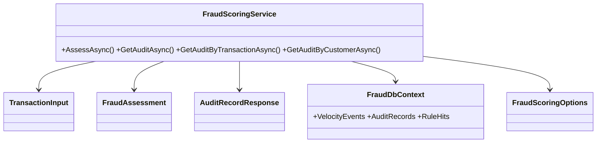
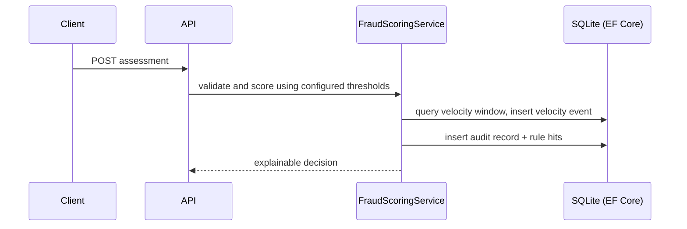

# UML

```mermaid
classDiagram
  class FraudScoringService { +AssessAsync() +GetAuditAsync() +GetAuditByTransactionAsync() +GetAuditByCustomerAsync() }
  class FraudDbContext { +VelocityEvents +AuditRecords +RuleHits }
  class TransactionInput
  class FraudAssessment
  class AuditRecordResponse
  class FraudScoringOptions
  FraudScoringService --> TransactionInput
  FraudScoringService --> FraudAssessment
  FraudScoringService --> AuditRecordResponse
  FraudScoringService --> FraudDbContext
  FraudScoringService --> FraudScoringOptions
```

```mermaid
sequenceDiagram
  participant C as Client
  participant A as API
  participant S as FraudScoringService
  participant DB as SQLite (EF Core)
  C->>A: POST assessment
  A->>S: validate and score using configured thresholds
  S->>DB: query velocity window, insert velocity event
  S->>DB: insert audit record + rule hits
  S-->>A: explainable decision
```
